# Socket.io Chat Application Guide

## Architecture Overview

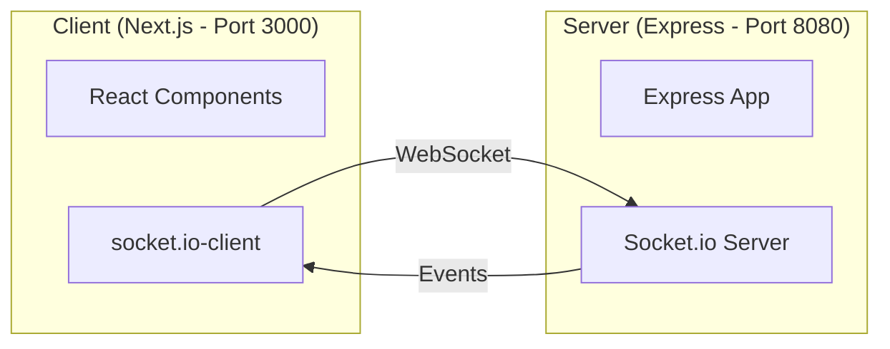

---

## 1. Socket Connection Flow

### How WebSocket Differs from HTTP

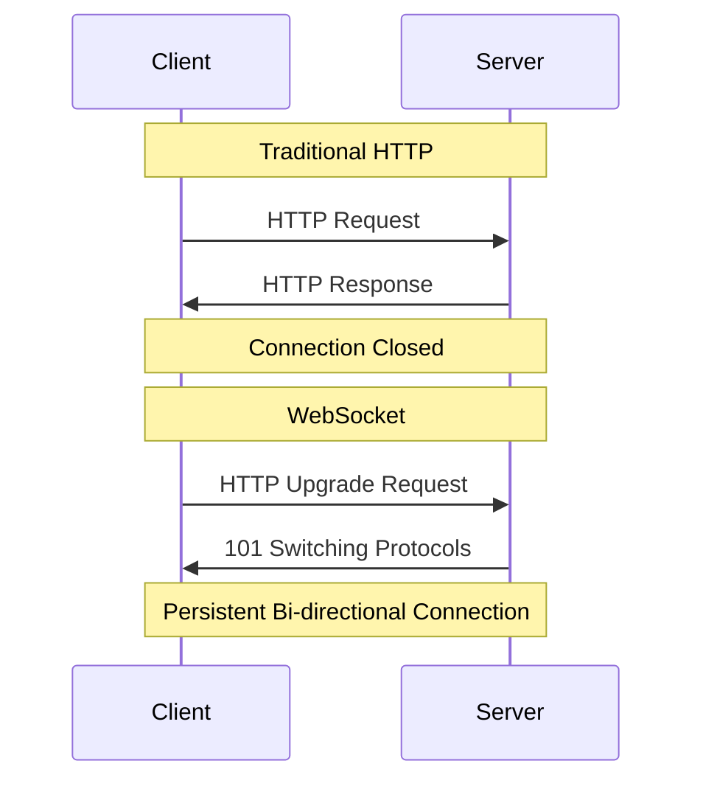

### Connection Lifecycle

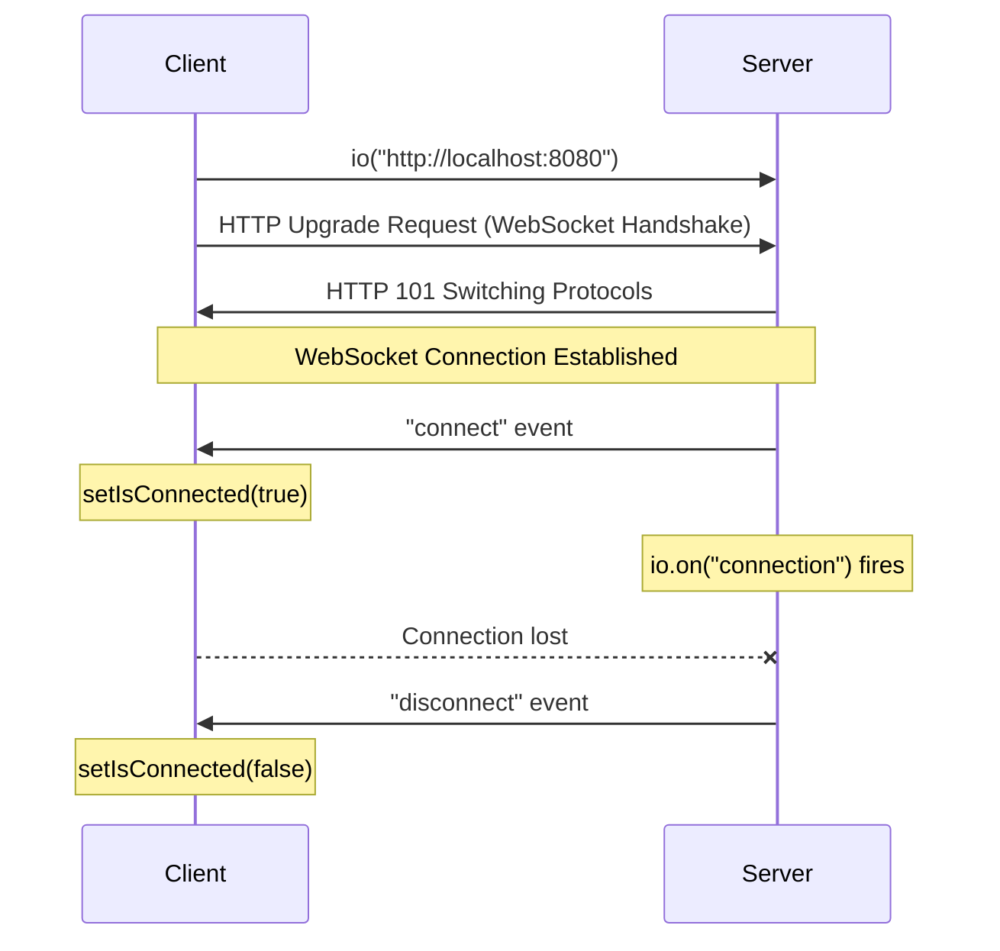

### Client Connection Code

```typescript
// socket.ts
import { io } from "socket.io-client";

const URL = "http://localhost:8080";
export const socket = io(URL);
```

```typescript
// page.tsx - Connection handling
useEffect(() => {
  function onConnect() {
    setIsConnected(true); // Update UI state
  }

  function onDisconnect() {
    setIsConnected(false);
  }

  socket.on("connect", onConnect);
  socket.on("disconnect", onDisconnect);

  return () => {
    socket.off("connect", onConnect);
    socket.off("disconnect", onDisconnect);
  };
}, []);
```

### Server Connection Code

```typescript
// server.ts
io.on("connection", (socket) => {
  console.log("User connected:", socket.id);

  socket.on("disconnect", () => {
    console.log("User disconnected:", socket.id);
  });
});
```

---

## 2. Chat Message Flow

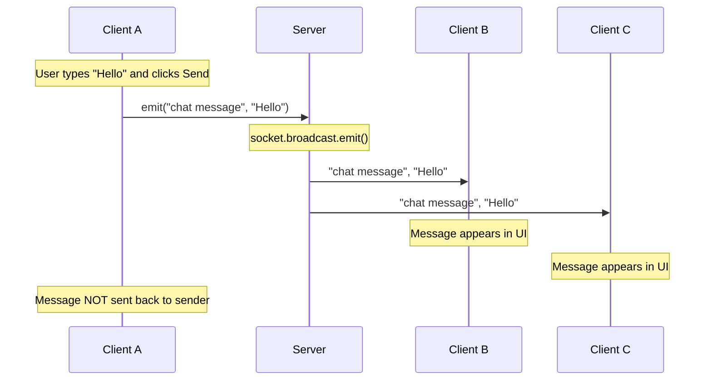

### Emit Methods Comparison

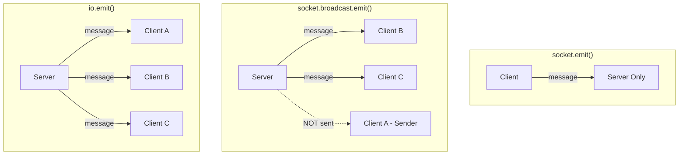

| Method                    | Description                       |
| ------------------------- | --------------------------------- |
| `socket.emit()`           | Send to the server only           |
| `socket.broadcast.emit()` | Send to all clients EXCEPT sender |
| `io.emit()`               | Send to ALL connected clients     |

---

## 3. Typing Indicator Flow

### State Management

```typescript
// Client state
const [typingUsers, setTypingUsers] = useState<Set<string>>(new Set());
const typingTimeoutRef = useRef<NodeJS.Timeout | null>(null);
```

### Complete Flow

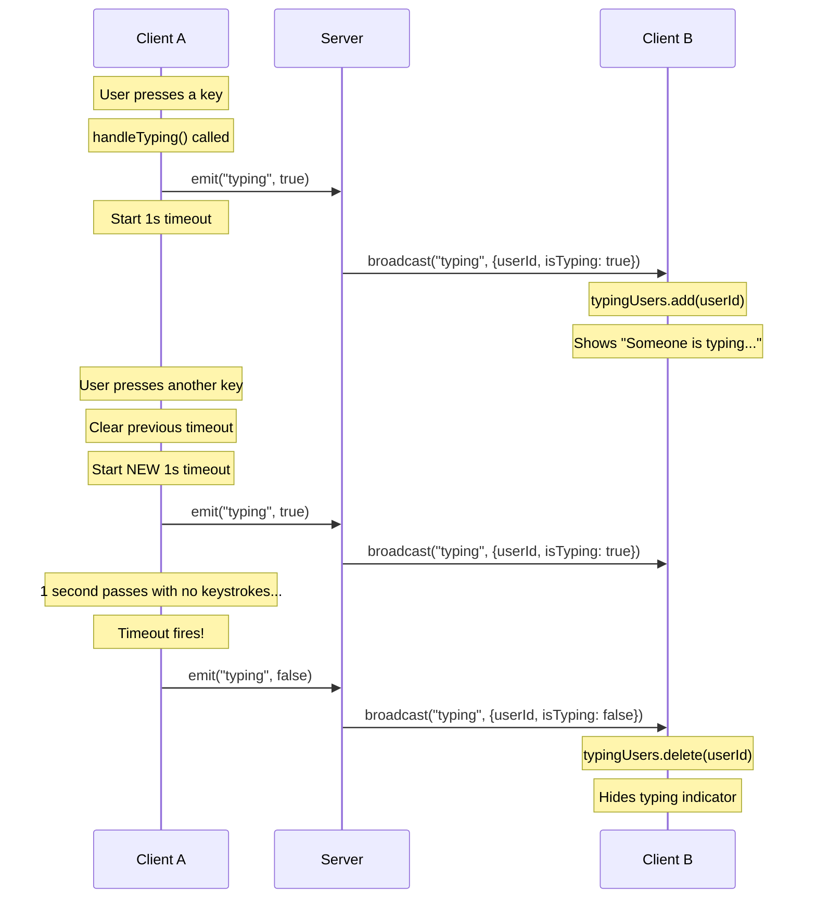

### Debouncing Logic

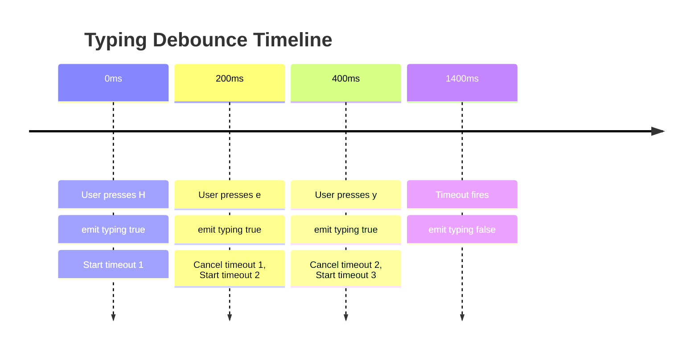

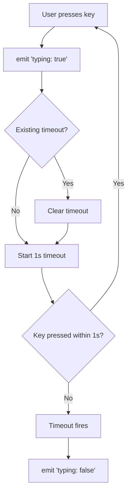

### Client Code

```typescript
const handleTyping = () => {
  // Tell server we're typing
  socket.emit("typing", true);

  // Clear any existing timeout
  if (typingTimeoutRef.current) {
    clearTimeout(typingTimeoutRef.current);
  }

  // Set new timeout - will fire if no keystroke for 1 second
  typingTimeoutRef.current = setTimeout(() => {
    socket.emit("typing", false);
  }, 1000);
};

// Listen for typing events from others
function onTyping({ userId, isTyping }: { userId: string; isTyping: boolean }) {
  setTypingUsers((prev) => {
    const next = new Set(prev);
    if (isTyping) {
      next.add(userId);
    } else {
      next.delete(userId);
    }
    return next;
  });
}
```

### Server Code

```typescript
socket.on("typing", (isTyping: boolean) => {
  // Forward typing status to all OTHER clients
  socket.broadcast.emit("typing", {
    userId: socket.id,
    isTyping,
  });
});
```

---

## 4. Complete Event Flow

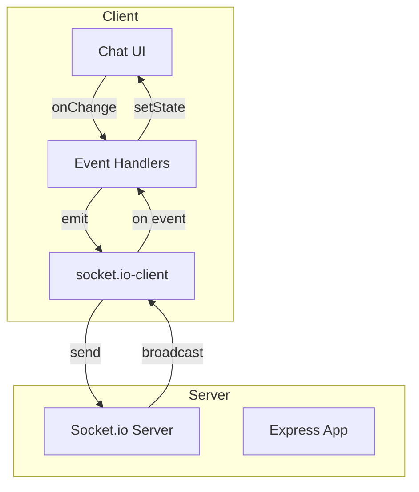

## 5. Event Summary

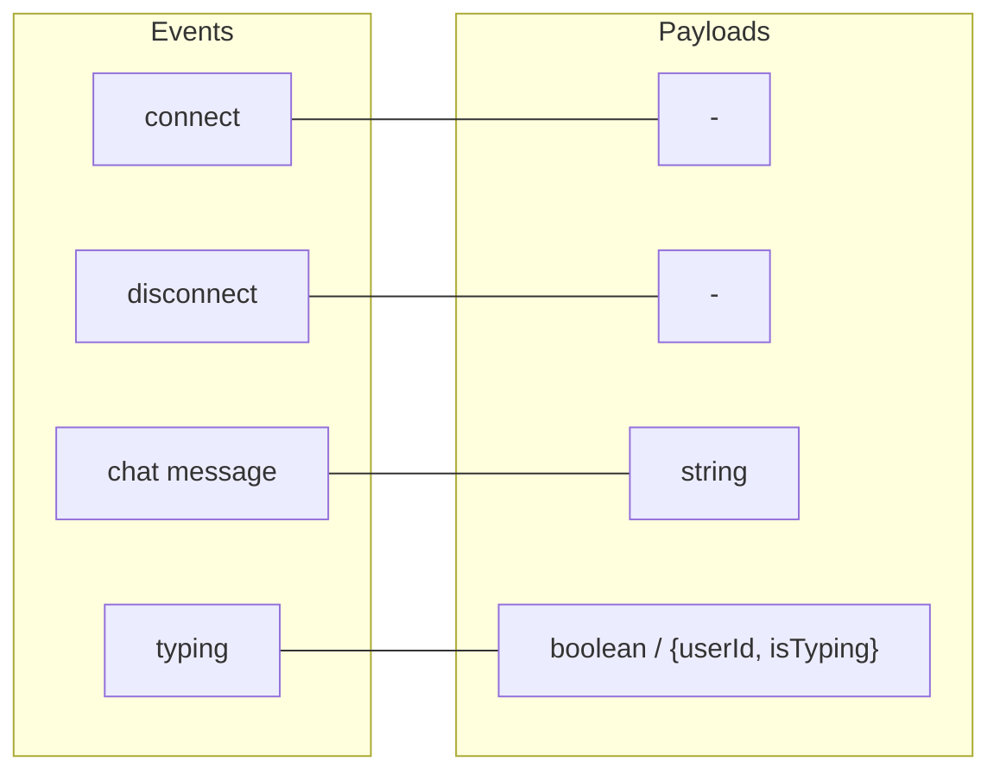

| Event          | Direction                | Payload              | Purpose                        |
| -------------- | ------------------------ | -------------------- | ------------------------------ |
| `connect`      | Server → Client          | -                    | Connection established         |
| `disconnect`   | Server → Client          | -                    | Connection lost                |
| `chat message` | Client → Server → Others | `string`             | Send a chat message            |
| `typing`       | Client → Server          | `boolean`            | User started/stopped typing    |
| `typing`       | Server → Others          | `{userId, isTyping}` | Notify others of typing status |

---

## 6. File Structure

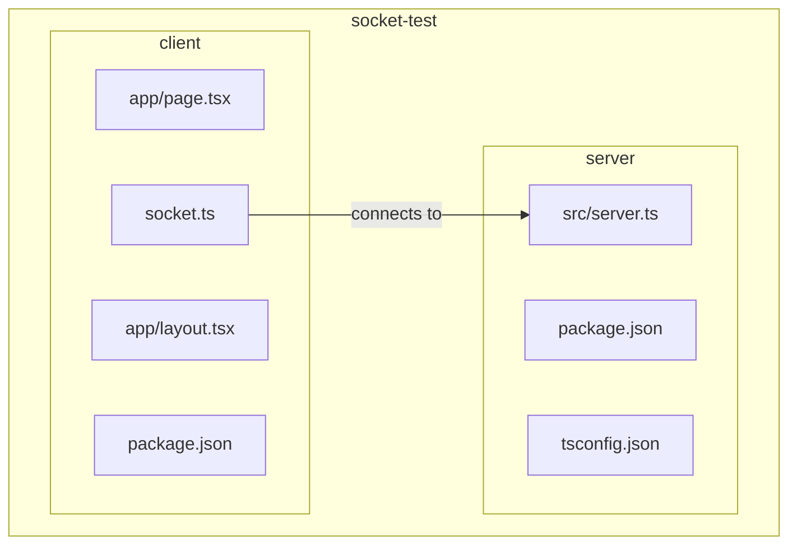

---

## 7. Running the Application

```bash
# Terminal 1 - Start server
cd server
npm run dev
# Server running at http://localhost:8080

# Terminal 2 - Start client
cd client
npm run dev
# Client running at http://localhost:3000
```

Open http://localhost:3000 in two browser tabs to test the chat.
